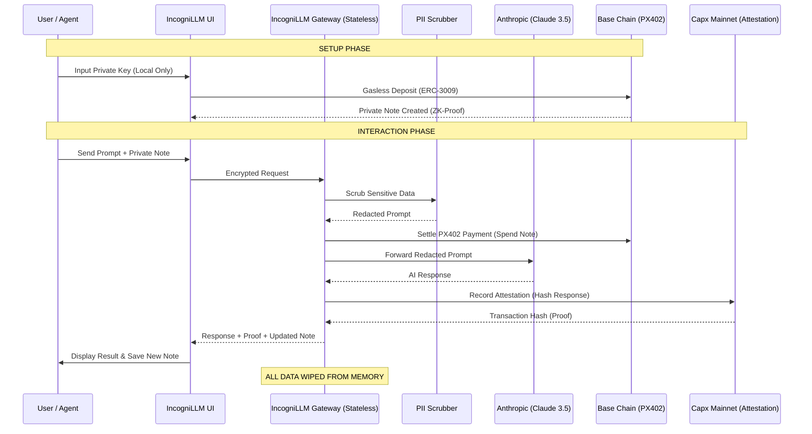

# IncogniLLM 🛡️🤖

**The Zero-Knowledge, Verifiable AI Gateway for the Agentic Economy.**

IncogniLLM is a high-privacy autonomous gateway that decouples user identity, payment trails, and AI interactions. It uses **ZK-Payments (PX402)**, **Sovereign Identity (ERC-8004)**, and **On-Chain Attestations (Capx Mainnet)** to ensure your AI usage is private yet cryptographically verifiable.

---

## 🔄 The User Flow: From Zero to Capx Mainnet

Here is exactly how a user (or an autonomous agent) interacts with IncogniLLM:

### 1. Identity & Deposit (The Setup)
*   **Identity**: The user/agent initializes an **ERC-8004 Agent Card**. This is a self-sovereign identity that doesn't rely on centralized logins.
*   **ZK-Deposit**: The user performs a **gasless deposit** of USDC via the **PX402 protocol**. 
    *   *Behind the scenes*: A ZK-Proof is generated, and a private **Note** (UTXO) is created. This Note represents your balance without linking it to your public wallet address on every transaction.

### 2. The Private Request (The Interaction)
*   **Prompting**: The user sends a prompt (e.g., "Analyze this secret API key: `sk-12345`").
*   **PII Scrubbing**: Before the prompt leaves the gateway, the **PII Scrubber** automatically detects and redacts sensitive info (Emails, Keys, IPs).
    *   *Result*: The LLM only sees: "Analyze this secret API key: `[SECRET_REDACTED]`".

### 3. ZK-Payment & AI Processing
*   **Micropayment**: The gateway spends a fraction of the private **Note** (e.g., 0.01 USDC) to pay for the request using the **PX402 protocol**.
*   **LLM Execution**: The redacted prompt is sent to **Anthropic (Claude 3.5 Sonnet)**.
*   **Statelessness**: The gateway processes the response in memory and **immediately wipes** the original prompt. No logs, no database.

### 4. On-Chain Attestation (The Proof)
*   **Hashing**: The gateway takes the AI's response and creates a cryptographic hash (`SHA-256`).
*   **Capx Recording**: This hash, linked to the payment ID, is sent to the `IncogniAttestor` smart contract on **Capx Mainnet**.
*   **Verification**: The user receives the AI response PLUS a **CapxScan link**. Anyone can verify that "Response X was delivered for Payment Y" without ever seeing the content of the response.

---

## 📊 Workflow Diagram

---

## 🛠 Tech Stack
- **Privacy**: PX402 (ZK-Payments), PII Regex Scrubber.
- **Identity**: ERC-8004 (Autonomous Agent Identity).
- **Integrity**: Capx Mainnet (Smart Contract Attestations).
- **AI**: Anthropic Claude 3.5 Sonnet.
- **Blockchain**: Base (Payments), Capx (Attestations).

---

## 🚀 Deployment to Replit

1.  **Import** this repo to Replit.
2.  **Secrets Configuration**:
    - `ANTHROPIC_API_KEY`: Your Anthropic API Key.
    - `PRIVATE_KEY`: Wallet private key (for attestation gas).
    - `CAPX_MAINNET_RPC`: `https://rpc.capx.ai`
    - `ATTESTATION_CONTRACT_ADDRESS`: `0x000EB5A3D2c2ceF6cdBa182fC19faE9b88e91c4A`
3.  **Run**: Click the "Run" button.

---

## 📜 Smart Contract (Capx Mainnet)
- **Address**: `0x000EB5A3D2c2ceF6cdBa182fC19faE9b88e91c4A`
- **Explorer**: [Capx Scan](https://capxscan.com)

---

## 📄 License
ISC License - Copyright (c) 2025 Modolo OSS
