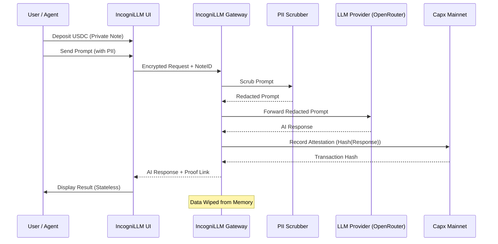

# IncogniLLM 🛡️🤖

**The Zero-Knowledge, Verifiable AI Gateway for the Agentic Economy.**

IncogniLLM is an autonomous privacy gateway designed to decouple user identity, payment trails, and AI interactions. In the age of autonomous agents, IncogniLLM ensures that your AI usage remains private, verifiable, and secure.

---

## 📑 Table of Contents
- [Vision](#-vision)
- [System Architecture](#-system-architecture)
- [Key Features](#-key-features)
- [Tech Stack](#-tech-stack)
- [Workflow Diagram](#-workflow-diagram)
- [Getting Started](#-getting-started)
- [Smart Contract](#-smart-contract)
- [Security & Privacy](#-security--privacy)

---

## 🌟 Vision
Traditional AI interactions create a "Black Box" of data trails—linking your identity, your payments, and your sensitive prompts. IncogniLLM breaks this link by moving from **Trust-based Privacy** to **Verification-based Privacy** using ZK-Payments and On-Chain Attestations.

## 🏗 System Architecture
IncogniLLM acts as a stateless intermediary between the User (or Agent) and the LLM Provider (OpenRouter).

1.  **Identity Layer (ERC-8004)**: Sovereign identity management.
2.  **Payment Layer (px402)**: Invisible, gasless ZK-payments.
3.  **Privacy Layer (PII Scrubber)**: Automatic redaction of sensitive data.
4.  **Integrity Layer (Capx Attestation)**: Cryptographic proof of service.

## ✨ Key Features
- **Invisible ZK-Payments**: Pay for AI services anonymously without manual transaction approvals for every prompt.
- **On-Chain Attestation**: Every AI response is hashed and recorded on the **Capx Mainnet**, providing a verifiable proof of delivery.
- **Automatic PII Scrubbing**: Advanced regex-based scrubbing of Emails, Phone Numbers, and API Keys before they reach the LLM.
- **Stateless Gateway**: No database. User data is wiped from memory immediately after the response is generated.
- **Stealth UI**: A premium, glassmorphic dashboard designed for the modern privacy-conscious user.

## 🛠 Tech Stack
- **Backend**: Node.js, Express, TypeScript, Ethers.js.
- **Frontend**: React, Vite, Tailwind CSS v4, Framer Motion.
- **Blockchain**: Solidity, Hardhat, Capx Mainnet.
- **AI**: OpenRouter (Access to GPT-4, Claude 3.5, etc.).

## 📊 Workflow Diagram



---

## 🚀 Getting Started

### Prerequisites
- Node.js (v18+)
- npm or pnpm
- A wallet with CAPX tokens (for Mainnet deployment)

### Installation

1.  **Clone the repository**:
    ```bash
    git clone https://github.com/Modolo-oss/IncogniLLM.git
    cd IncogniLLM
    ```

2.  **Install Dependencies**:
    ```bash
    # Root (Backend)
    npm install
    # Frontend
    cd frontend && npm install
    # Blockchain
    cd ../blockchain && npm install
    ```

3.  **Environment Setup**:
    Create a `.env` file in the root directory:
    ```text
    PORT=3000
    OPENROUTER_API_KEY=your_key
    CAPX_MAINNET_RPC=https://rpc.capx.ai
    PRIVATE_KEY=your_wallet_private_key
    ATTESTATION_CONTRACT_ADDRESS=0x000EB5A3D2c2ceF6cdBa182fC19faE9b88e91c4A
    ```

### Running Locally

1.  **Start Backend**:
    ```bash
    npm run dev
    ```
2.  **Start Frontend**:
    ```bash
    cd frontend
    npm run dev
    ```

---

## 📜 Smart Contract
The `IncogniAttestor` contract is deployed on **Capx Mainnet**:
- **Address**: `0x000EB5A3D2c2ceF6cdBa182fC19faE9b88e91c4A`
- **Network**: Capx Mainnet (Chain ID: 757)
- **Explorer**: [Capx Scan](https://capxscan.com)

## 🔒 Security & Privacy
- **No Logs**: We do not store prompts or responses.
- **Client-Side Encryption**: Identity data is handled via ERC-8004 standards.
- **Verifiable**: Anyone can check the Capx Scan to see that an attestation was made for a specific payment ID.

---

## 📄 License
ISC License - Copyright (c) 2025 Modolo OSS
